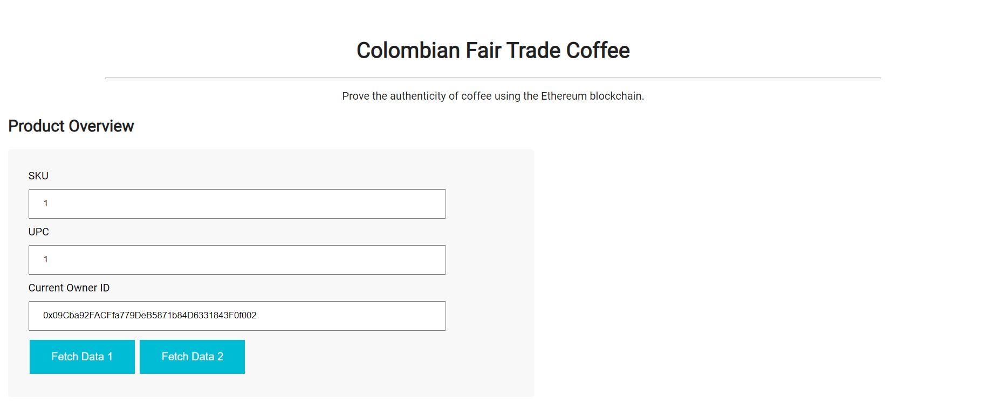
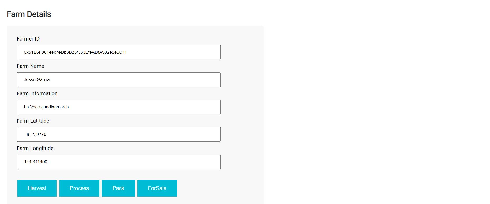
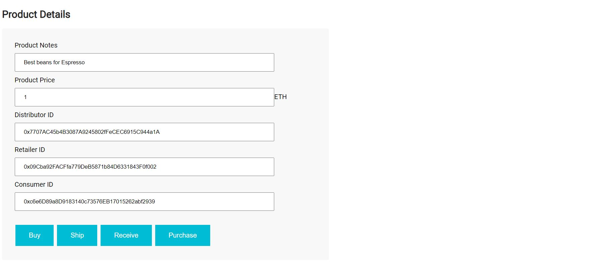

# Project Ethereum Dapp for Tracking Items through Supply Chain

# Supply chain & data auditing

This repository containts an Ethereum DApp that demonstrates a Supply Chain flow between a Seller and Buyer. The user story is similar to any commonly used supply chain process. A Seller can add items to the inventory system stored in the blockchain. A Buyer can purchase such items from the inventory system. Additionally a Seller can mark an item as Shipped, and similarly a Buyer can mark an item as Received.

## The DApp User Interface when running should look like...








## Truffle Version
>
    Truffle v5.1.51
>

## Node Version
>
   Node v14.9.0
>

## web3 Version
>
    web3@1.0.0-beta.37
>
## Contract Address
>
    0x20A8467f4292d480a868ABA47711D9499D430387 

    https://rinkeby.etherscan.io/address/0x20a8467f4292d480a868aba47711d9499d430387

## Transation Details: Matamask
   
https://rinkeby.etherscan.io/tx/0xb7ac7c7b75cfce951edbcd76d6aca9239a66a8362cc60c42f24dfe9e55ea17cb

## Item Information

Transaction: 0xb7ac7c7b75cfce951edbcd76d6aca9239a66a8362cc60c42f24dfe9e55ea17cb

# Transaction History

Harvested - 0x8ec7c7b3ca136ad06ee8fd386c81929631944a87e1ff415e1b258aa131435005
Processed - 0x05df4513f5eb54d8d4e2365fab5950c97fcde402eb4b94a57d6f11e2cde15701
Packed - 0x856237b3667016a1d3d02f4c11e8de295a5ab25e4060d7f4b43cb26d55c06f91
ForSale - 0xc5d96828797bb3dcee825fd8c1f585b777c2e3adcde26186a36ac58a494cb65a
Sold - 0x4273bea207e0b41325037dda8089273e9d018fd25642d644e8d64ef80bbfe653
Shipped - 0x818b404062dad6bb19f329d13d5639d654a329f227c65220bcd4a9022361b108
Received - 0x150a5cb7f1c051a8490d3a4cdf2be3a866d5348aeeb2da53b75b04901366c5fa
Purchased - 0xb7ac7c7b75cfce951edbcd76d6aca9239a66a8362cc60c42f24dfe9e55ea17cb

## Requirement UML:
UML file loaded

## Requirement 2: Project write-up - Libraries
One of the library called Roles which made it easier to manage AccessControl in my DAPP. It made it easy to add and remove roles in each of my AccessControl contracts.

## Requirement 3: Project write-up - IPFS
I did not use IPFS to deliver my website for this project. However, I could have added my HTML, CSS, and JS files to IPFS in order to fully decentralize my Supply Chain DAPP.

### Prerequisites

Installed ganache-cli, Truffle and enabled MetaMask extension in your browser.

### Installing

Clone this repository:

```
git clone https://github.com/jgdovis/Project-Ethereum-Dapp-for-Tracking-Items-through-Supply-Chain
```

Change directory to ```project-6``` folder and install all requisite npm packages (as listed in ```package.json```):

```
cd project-6
npm install

```

Launch Ganache:

```
truffe-contract.js (change mnemonic to Ganache-cli secret key)

run comman:
ganache-cli -m "Ganache secret key" for Testing contract.

Deploy to Rinkeby test network information

Rinkeby network:
to run on test Rinkeby Network change to Metamask secret key.
truffe-contract.js (change mnemonic to Metamask secret key)

run comman:

truffle develop
or
truffle migrate --reset --network rinkeby

```

In a separate terminal window, Compile smart contracts:

```
truffle compile
```

This will create the smart contract artifacts in folder ```build\contracts```.

Migrate smart contracts to the locally running blockchain, ganache-cli:

```
truffle migrate
```

Test smart contracts:

```
truffle test
```

All 10 tests should pass.

In a separate terminal window, launch the DApp:

```
npm run dev
```

# Built With
Ethereum - Ethereum is a decentralized platform that runs smart contracts
Truffle Framework - Truffle is the most popular development framework for Ethereum with a mission to make your life a whole lot easier.

# Acknowledgments
Solidity
Ganache-cli
Truffle